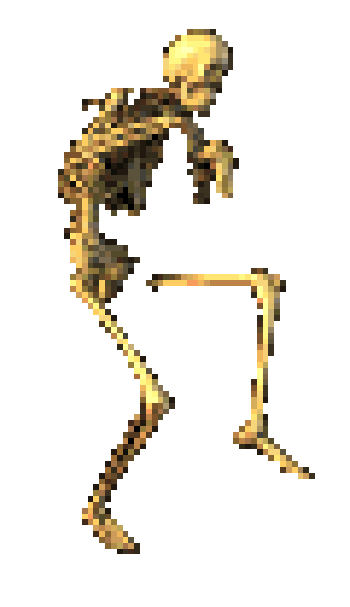

<h1 align="center"><!--img src="calaca.gif" width="28px" alt="d"-->  Buenas  </h1>

    <!--<b>Welcome</b> -->
    <i>
        Enjoying learning a little bit of everything. Enthusiast of insects and mathematics. 
    </i> 

### Languages & Technologies

<!---->
<!---->

### Software
<!---->
<!---->

    

        
    

    

    

